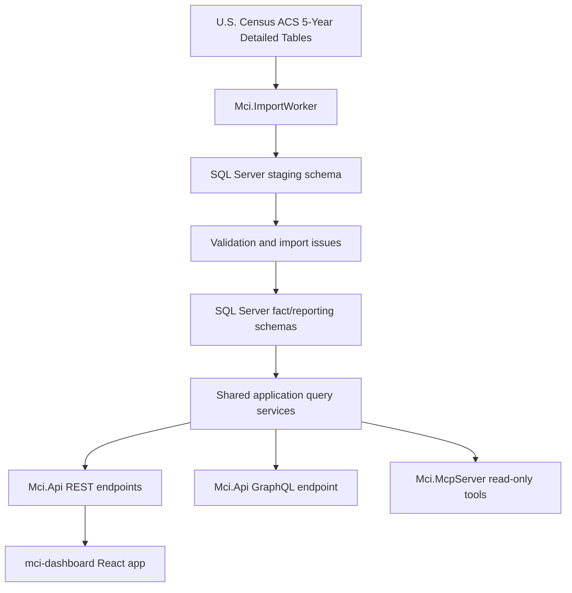

# Michigan County Insights

Michigan County Insights is a portfolio project that demonstrates reporting systems, integration pipelines, SQL Server database design, .NET backend services, REST APIs, GraphQL APIs, React dashboards, and read-only MCP integration using public county-level data.

The V1 data source is the U.S. Census Bureau ACS 5-Year Detailed Tables for Michigan counties.

## Architecture



Current project boundaries:

- `Mci.Core`: domain entities, enums, and application contracts.
- `Mci.Infrastructure`: EF Core, SQL Server mappings, seed data, Census client, import services, and query service implementations.
- `Mci.ImportWorker`: manual import runner for raw staging and fact loading.
- `Mci.Api`: health, Swagger, REST reporting, REST operations, and GraphQL.
- `Mci.McpServer`: read-only MCP stdio server backed by shared query services.
- `mci-dashboard`: Vite/React dashboard.
- `Mci.Infrastructure.Tests`: focused database/query tests.

## Data Notes

ACS 5-Year releases are rolling five-year periods. Adjacent releases should not be described as normal year-over-year changes. API responses include comparison guidance so clients can label observations correctly.

The initial V1 metric catalog includes population, income, poverty, labor-force participation, education, home value, and rent metrics for Michigan's 83 counties.

## How To Run Locally

Prerequisites:

- .NET 9 SDK
- SQL Server LocalDB or another SQL Server-compatible database
- Optional Census API key for import runs

Restore and build:

```powershell
dotnet restore Mci.sln
dotnet build Mci.sln
```

Start the local API and dashboard together:

```powershell
.\run-local.ps1
```

The script builds the .NET solution, installs dashboard packages when `node_modules` is missing, builds the dashboard, starts the API on `http://localhost:5087`, starts the Vite dashboard on `http://localhost:5173`, writes logs and PID files under `artifacts/`, and opens the dashboard in a browser.

Useful options:

```powershell
.\run-local.ps1 -ApplyMigrations
.\run-local.ps1 -SkipBuild -SkipDashboardBuild
.\run-local.ps1 -NoBrowser
```

Create the local database schema:

```powershell
dotnet ef database update --project src/Mci.Infrastructure --startup-project src/Mci.Api
```

For local Census imports, create `src/Mci.Api/appsettings.Local.json` or `src/Mci.ImportWorker/appsettings.Local.json` with:

```json
{
  "Census": {
    "ApiKey": "YOUR_KEY_HERE"
  }
}
```

`appsettings.Local.json` is gitignored.

Run the API:

```powershell
dotnet run --project src/Mci.Api --launch-profile http
```

Run the import pipeline manually:

```powershell
dotnet run --project src/Mci.ImportWorker -- raw-stage
dotnet run --project src/Mci.ImportWorker -- load-facts
```

Or run staging and fact loading together:

```powershell
dotnet run --project src/Mci.ImportWorker -- stage-and-load-facts
```

Run tests:

```powershell
dotnet test Mci.sln
```

## Container Builds

The API and import worker have separate Dockerfiles. Build from the repository root so project references and central package management files are available to Docker.

```powershell
docker build -f src/Mci.Api/Dockerfile -t mci-api:local .
docker build -f src/Mci.ImportWorker/Dockerfile -t mci-import-worker:local .
```

Run the API container:

```powershell
docker run --rm -p 8080:8080 `
  -e ASPNETCORE_ENVIRONMENT=Production `
  -e ConnectionStrings__MciDatabase="Server=tcp:YOUR_SERVER.database.windows.net,1433;Initial Catalog=mci-prod;User ID=YOUR_USER;Password=YOUR_PASSWORD;Encrypt=True;TrustServerCertificate=False;" `
  -e Census__BaseUrl="https://api.census.gov/data" `
  -e Census__ApiKey="YOUR_KEY" `
  -e Imports__DefaultAcsReleaseYear=2024 `
  mci-api:local
```

Run the import worker container:

```powershell
docker run --rm `
  -e DOTNET_ENVIRONMENT=Production `
  -e ConnectionStrings__MciDatabase="Server=tcp:YOUR_SERVER.database.windows.net,1433;Initial Catalog=mci-prod;User ID=YOUR_USER;Password=YOUR_PASSWORD;Encrypt=True;TrustServerCertificate=False;" `
  -e Census__BaseUrl="https://api.census.gov/data" `
  -e Census__ApiKey="YOUR_KEY" `
  -e Imports__DefaultAcsReleaseYear=2024 `
  mci-import-worker:local stage-and-load-facts
```

For Azure Container Apps, use platform secrets/environment variables rather than JSON files in the image. Required production configuration:

- `ConnectionStrings__MciDatabase`
- `Census__BaseUrl`
- `Census__ApiKey`
- `Imports__DefaultAcsReleaseYear`

The published containers intentionally do not include `appsettings.Development.json` or `appsettings.Local.json`.

## Analytics

The dashboard uses [Microsoft Clarity](https://clarity.microsoft.com) (free) for pageview counts, visitor counts, session recordings, and heatmaps.

- Create a free Clarity project and copy its project id.
- Add a repository secret named `CLARITY_PROJECT_ID` with that value. The `Deploy Dashboard` workflow passes it to the build as `VITE_CLARITY_PROJECT_ID`.
- The tracking script is injected only when `VITE_CLARITY_PROJECT_ID` is set, so local development and any build without the secret stay tracking-free.

## Domains and DNS

The frontend is served from Azure Static Web Apps and is intended to be reached at `portfolio.josueq.com`. Custom-domain binding and DNS live in Azure/your DNS provider, not in this repository.

Recommended setup:

- **`portfolio.josueq.com`** — add it as a custom domain on the Static Web App and create a `CNAME` record pointing `portfolio` to the SWA default `*.azurestaticapps.net` hostname. Complete the SWA domain-validation step.
- **`josueq.com` (apex)** — 301-redirect the apex to `https://portfolio.josueq.com`. An apex cannot be a raw `CNAME`, so use your DNS provider's ALIAS/redirect feature (or an Azure redirect). Point the apex `A`/`ALIAS` record at the redirect target and configure the rule to send `https://josueq.com/*` to `https://portfolio.josueq.com`.

A redirect (rather than binding both domains to the same app) keeps a single canonical URL and needs no CORS change, since the apex never serves the app directly.

## Sample API Requests

Health:

```http
GET /health
```

Reporting:

```http
GET /api/reporting/counties
GET /api/reporting/metrics
GET /api/reporting/current-observations?metricCode=population&countyFipsCode=26161&releaseYear=2024
GET /api/reporting/current-observations/summary?releaseYear=2024
```

County detail and comparison (API-owned, formatting-neutral difference calculation):

```http
GET /api/counties/26161/detail?release=2024
GET /api/comparisons?left=26161&right=26081&release=2024
```

Operations:

```http
GET /api/operations/import-runs?releaseYear=2024&limit=10
GET /api/operations/import-runs?status=SucceededWithWarnings
GET /api/operations/import-issues?severity=Warning&limit=50
GET /api/operations/import-issues?importRunId=00000000-0000-0000-0000-000000000000
```

GraphQL:

```graphql
query {
  metrics {
    code
    displayName
  }
  counties {
    fipsCode
    name
  }
  currentObservations(metricCode: "population", countyFipsCode: "26161", releaseYear: 2024) {
    countyName
    metricCode
    estimateValue
    dataReleaseDisplayName
    comparisonGuidance
  }
}
```

## MCP Server

The MCP server is read-only and uses the same reporting query services as REST and GraphQL.

Run it as a stdio MCP server:

```powershell
$env:DOTNET_ENVIRONMENT = "Development"
dotnet run --project src/Mci.McpServer
```

Available tools:

- `GetCounties`
- `GetMetrics`
- `GetCurrentCountyMetricObservations`
- `CompareCountiesCurrentObservations`

## Operational Visibility

The import pipeline records:

- import run status and timing
- fetched, staged, inserted, and rejected record counts
- validation, transform, and load issues
- warning/error severity
- pipeline version

The API exposes read-only operational endpoints under `/api/operations`. Import services also emit structured logs for start, completion, counts, statuses, and failures.

## Current Scope

Implemented:

- SQL Server schema with reference, catalog, ops, staging, fact, and reporting schemas.
- Seed data for Michigan counties, metric catalog, and 2024 ACS 5-Year release.
- Census raw staging import.
- Staging validation and import issue recording.
- Fact loading for direct and derived V1 metrics.
- REST reporting and operations endpoints.
- GraphQL reporting queries.
- Read-only MCP reporting tools.
- Basic React dashboard foundation.

Not yet implemented:

- Authentication or admin write actions.
- Scheduled imports.
- Multi-state geography.
- Statistical significance calculations.
- Production deployment automation.
